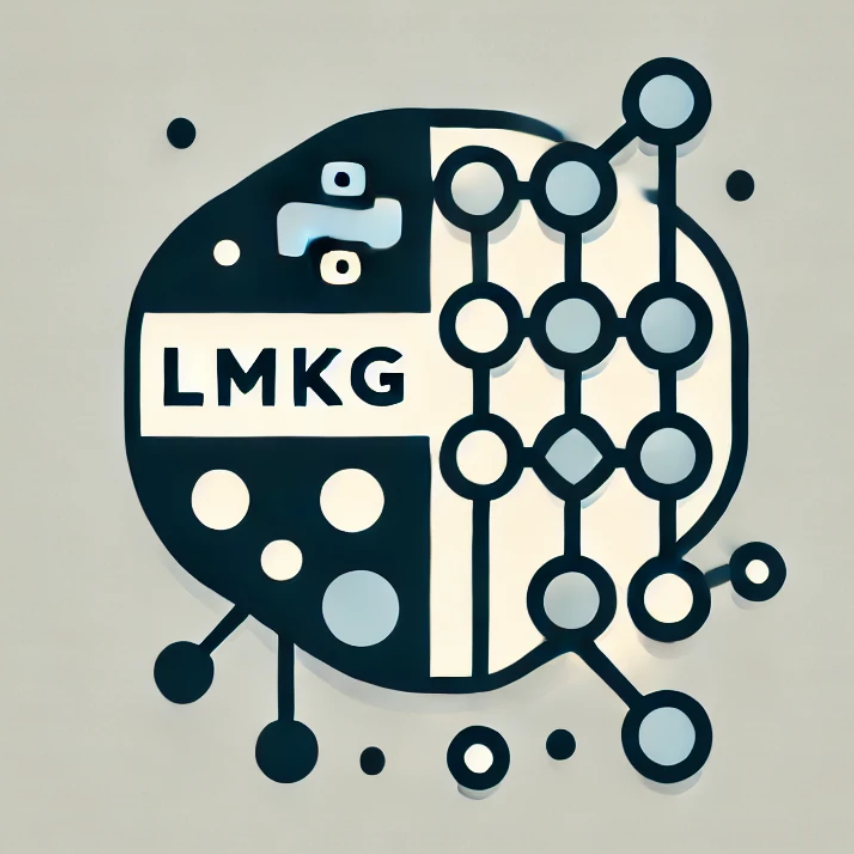

# LM🔗KG

<p align="center">
  
</p>


**LMKG** is a Python library designed to leverage the powerful combination of language models and knowledge graphs (KGs) to solve a variety of complex tasks. By relying on the structured information stored in KGs, LMKG enables language models to solve problems such as entity linking, relation extraction, and question answering with higher accuracy and contextual relevance.

The knowledge graph is accessed via a SPARQL endpoint that listens for queries, allowing seamless interaction between the language model and the graph. This design enables efficient querying of structured data, that scales to large knowledge graphs and can be adjusted for different graph databases (e.g. GraphDB, Anzograph, etc).

**Example: relation extraction**

Assume we are interested in mapping a relation expressed in text, to a predicate identifier on Wikidata. We define a **prompt** for this task using a jinja template:

```jinja
You are tasked with identifying the correct predicate identifier in a knowledge graph that corresponds to a relationship between two entities in the following text:

{{ text }}
```

Given an input `text`, LMKG prompts the language model to solve this problem while using the KG as a tool:

```shell
python main.py relation_extraction --text="Amsterdam is the capital of the Netherlands."
# The correct predicate identifier in the knowledge graph that corresponds to 
# the relationship between Amsterdam and the Netherlands is P1376.
```

# Installation

**Graph database:** LMKG currently supports [GraphDB](https://graphdb.ontotext.com/) as the graph database. While any other database that supports SPARQL could be used, we rely on its text capabilities for fast entity retrieval. Once GraphDB is installed, download the Wikidata5M dataset from this link and unzip it inside the `repositories` folder. Activate the repository on the GraphDB workbench, which will by default establish an endpoint at `http://localhost:7200/repositories/wikidata5m`.

**Installing LMKG:** We provide a conda environment file for creating a new environment called `lmkg` with all the dependencies:

```shell
conda env create -f environment.yml
```

# Running

- We currently support Llama 3.1 in its 8B and 70B sizes. These can be run locally with optional quantization, or via a [Text Generation Inference](https://huggingface.co/docs/text-generation-inference/en/index) client.
- By default, we assume a running graph endpoint at `http://localhost:7200/repositories/wikidata5m`.
- Three tasks are supported: `entity_linking`, `relation_extraction`, and `contradiction_generation`. Each of these tasks has a corresponding prompt in `lmkg/prompts`, defined as a jinja template with predefined arguments. The values for the arguments need to be passed via the command line.


Running entity linking locally with Llama 3.1 8B:
```shell
python main.py entity_linking \
--text="Amsterdam is the capital of the Netherlands"
```

Same example, but with 4bit quantization:
```shell
python main.py entity_linking \
--text="Amsterdam is the capital of the Netherlands" \
--quantization="4bit"
```

Running with Llama 3.1 70B via a Text Generation Inference endpoint running at `http://127.0.0.1:8080`:
```shell
python main.py entity_linking \
--text="Amsterdam is the capital of the Netherlands" \
--model="Llama-3.1-70B" \
--inference_client="http://127.0.0.1:8080"
```


