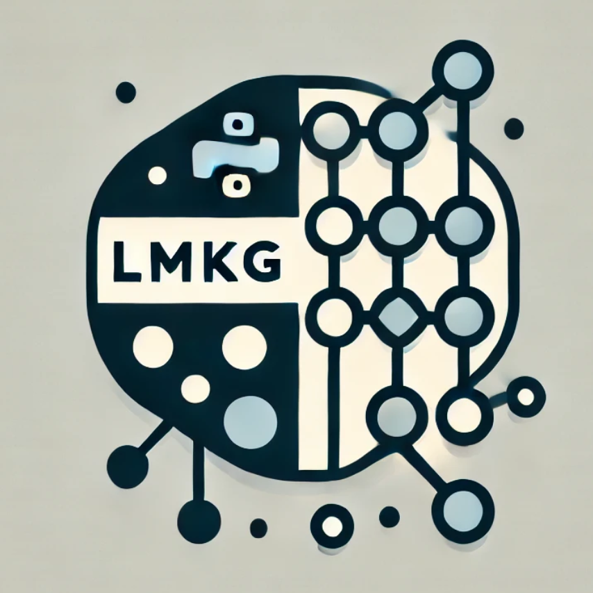

# LM🔗KG

<p align="center">
  
</p>


**LMKG** is a Python library designed to leverage the powerful combination of language models and knowledge graphs (KGs) to solve a variety of complex tasks. By relying on the structured information stored in KGs, LMKG enables language models to solve problems such as entity linking, relation extraction, and question answering with higher accuracy and contextual relevance.

The knowledge graph is accessed via a SPARQL endpoint that listens for queries, allowing seamless interaction between the language model and the graph. This design enables efficient querying of structured data, that scales to large knowledge graphs and can be adjusted for different graph databases (e.g. GraphDB, Anzograph, etc).

**Example: relation extraction**

Assume we are interested in mapping a relation expressed in text, to a predicate identifier on Wikidata. We define a **prompt** for this task using a jinja template:

```jinja
You are tasked with identifying the correct predicate identifier in a knowledge graph that corresponds to a relationship between two entities in the following text:

{{ text }}
```

Given an input `text`, LMKG prompts the language model to solve this problem while using the KG as a tool:

```shell
python -m lmkg relation_extraction --text="Amsterdam is the capital of the Netherlands."
# The correct predicate identifier in the knowledge graph that corresponds to 
# the relationship between Amsterdam and the Netherlands is P1376.
```

# Installation

**Graph database:** LMKG currently supports [GraphDB](https://graphdb.ontotext.com/) as the graph database. While any other database that supports SPARQL could be used, we rely on its text capabilities for fast entity retrieval. Once GraphDB is installed, you can download the Wikidata5M dataset from Zenodo and untar it inside the `repositories` folder:

```shell
cd ~/.graphdb/data/repositories
wget https://zenodo.org/records/17962315/files/wikidata5m.tar.zst
tar --use-compress-program=unzstd -xvf wikidata5m.tar.zst
```

Activate the repository on the GraphDB workbench, which will by default establish an endpoint at `http://localhost:7200/repositories/wikidata5m`.

**Installing LMKG:** Create a new conda environment, activate it, and install the Python dependencies with `pip`:

```shell
conda create -n lmkg python=3.11
conda activate lmkg
pip install -r requirements.txt
```

# Running

- **Graph endpoint**: By default, we assume a running graph endpoint at `http://localhost:7200/repositories/wikidata5m`.
- **Supported tasks**: `entity_linking`, `relation_extraction`, and `contradiction_generation`. Each task has a corresponding prompt in `lmkg/prompts`, defined as a jinja template with predefined arguments. The values for the arguments need to be passed via the command line.

### 1. LLM via API

LMKG uses an OpenAI-compatible chat completion API via `langchain_openai.ChatOpenAI`. We assume that the environment variable `OPENAI_API_KEY` is set and that the configured endpoint exposes the requested model. Use `--base_url` to point LMKG at your API endpoint. The current default is `https://ai-research-proxy.azurewebsites.net`.


Running entity linking:
```shell
python -m lmkg entity_linking \
--text="Amsterdam is the capital of the Netherlands" \
--base_url="https://your-openai-compatible-endpoint/v1" \
--model="gpt-5.1"
```

## 2. LLM running locally

Local frameworks that support OpenAI-compatible endpoints, like [vLLM](https://vllm.ai/), can also be used in LMKG. An example for using LMKG with vLLM running on the Snellius cluster is available at [`jobs/run_vllm_serve.job`](jobs/run_vllm_serve.job).

